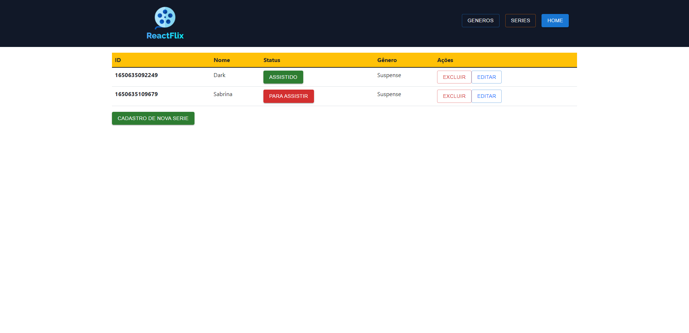

# Projeto Minhas Series - React

Projeto feito inteiramente em React, usando Styled Components e usando duas bibliotecas react, sendo elas o Bootstrap e o MUI.

## Table of contents

- [Projeto Minhas Series - React](#projeto-minhas-series---react)
  - [Table of contents](#table-of-contents)
  - [Overview](#overview)
    - [Built with](#built-with)
    - [Screenshot](#screenshot)
    - [Continued development](#continued-development)
    - [Useful resources](#useful-resources)
  - [Author](#author)

## Overview

### Built with

- Styled Components
- Flexbox
- Bootstrap React
- React UI
- React

### Screenshot

### Continued development

- Durante o desenvolvimento apliquei o processo de CRUD no react, usando duas bibliotecas, sendo elas o Bootstrap e o MUI. Utilizei em aglumas partes Styled Components.

### Useful resources

- [Bootstrap React](https://react-bootstrap.github.io/) - Images taken from here.
- [MUI](https://mui.com/pt/) - Documentation I'm based on.

## Author

- Website - [Portfólio](https://lucasf5.github.io/Portfolio/)
